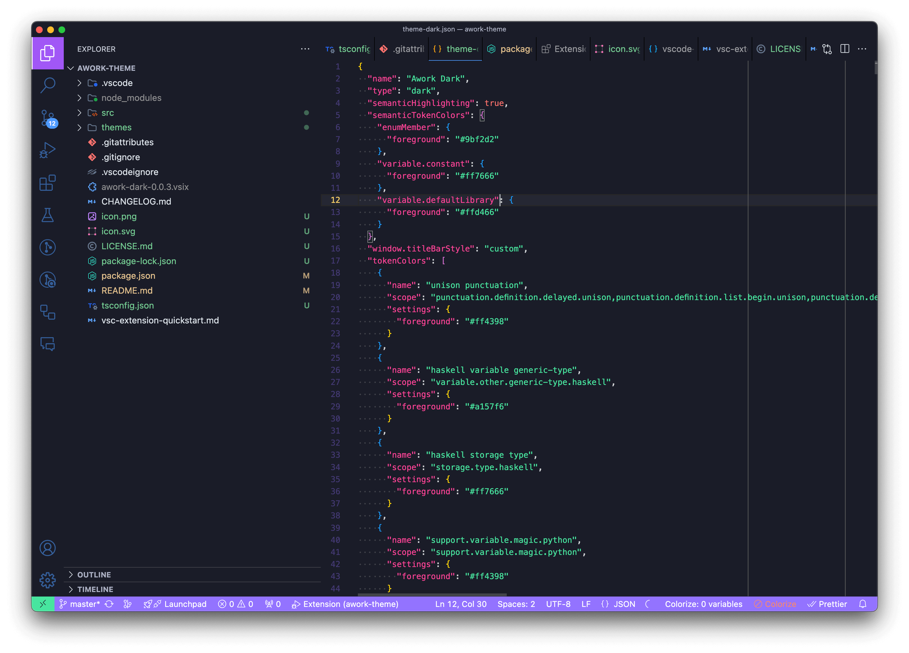

# awork theme

A theme in the colors of awork.

[awork.com](https://www.awork.com)

### Installation

- Install Visual Studio Code
- Launch Visual Studio Code
- Choose Extensions from menu
- Search for `awork`
- Click Install to install it
- Click Reload to reload the Code
- From the menu bar click: Code > Preferences > Color Theme > awork

